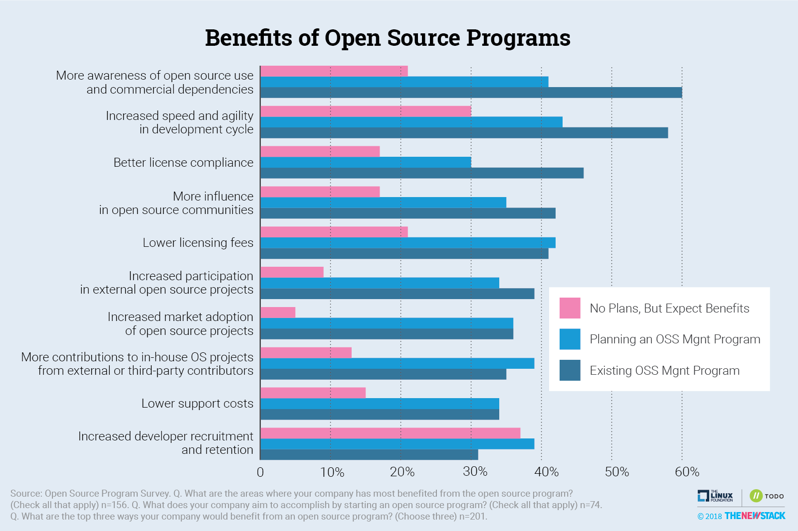
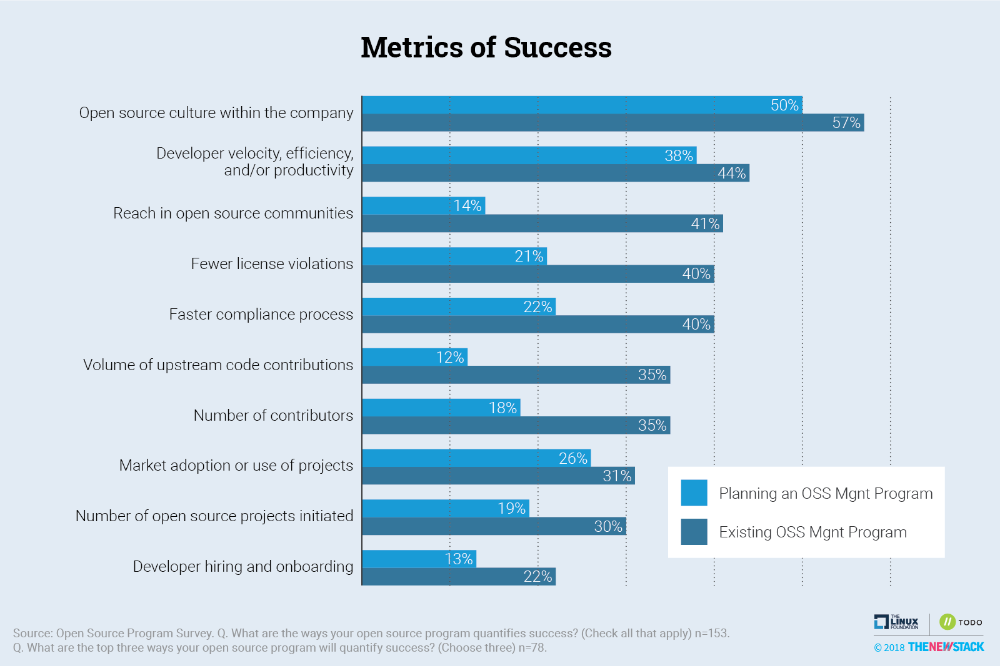
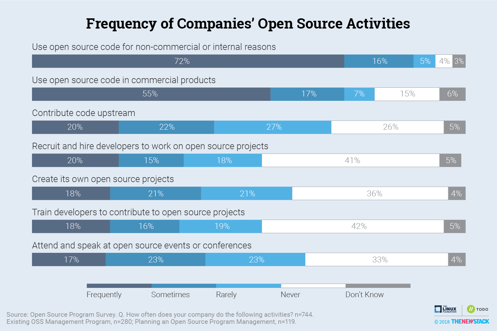
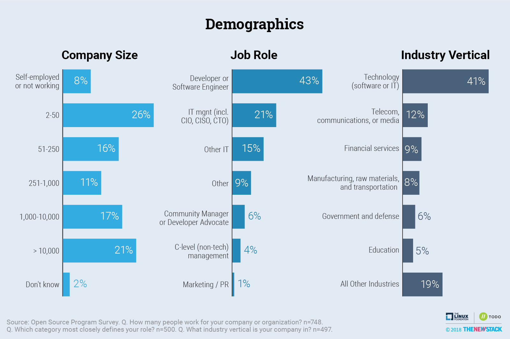
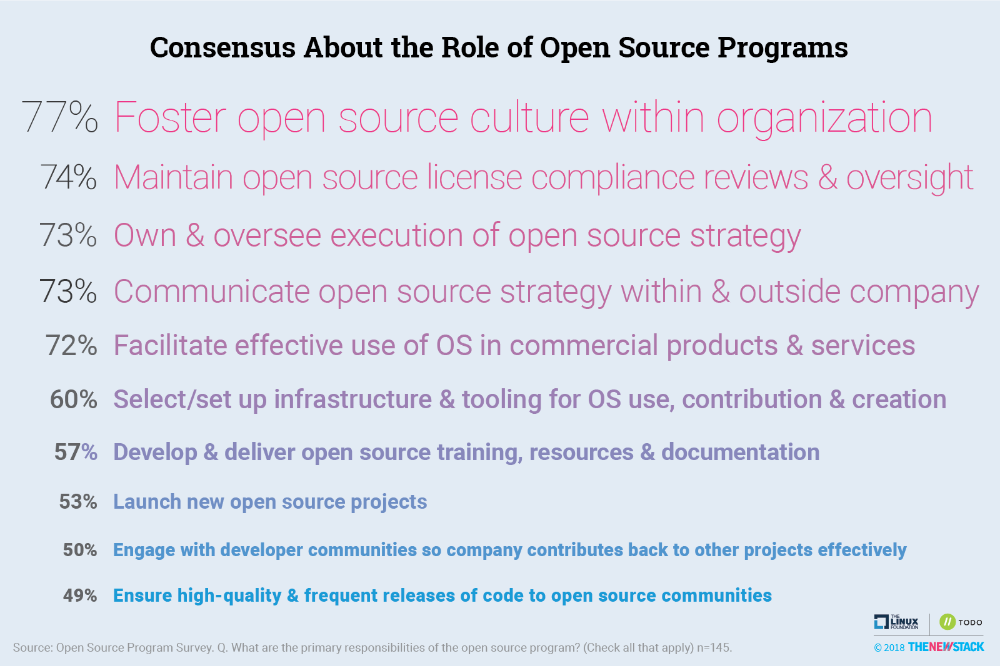
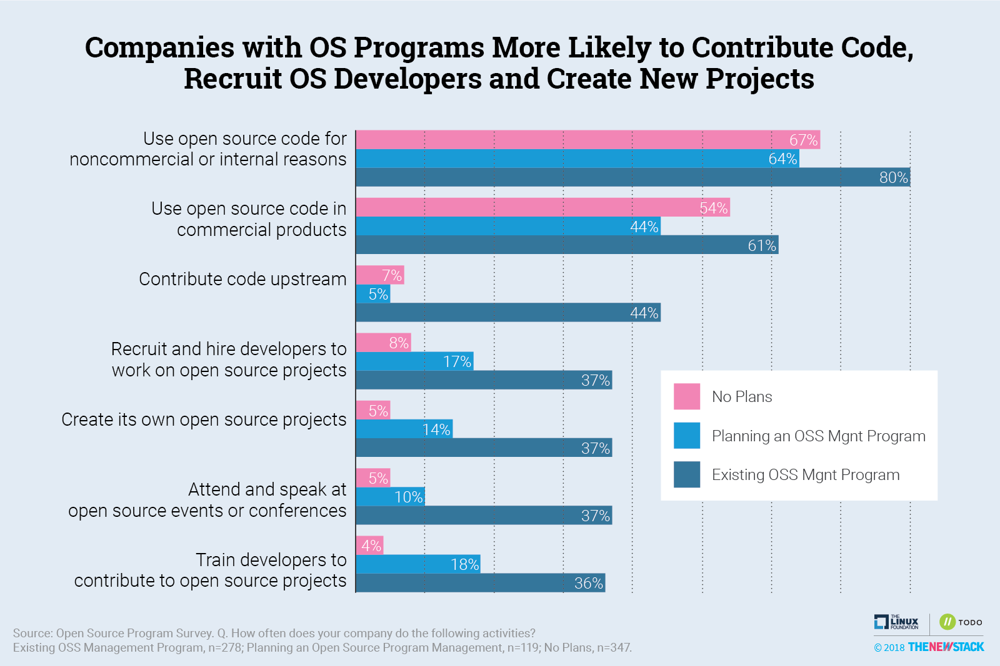

# Open Source Programs Survey

The TODO Group is proud to have run the first open source programs survey in the industry. Formal open source programs are quickly becoming an emerging best practice for all organizations. The TODO Group is committed to running this survey on an annual basis moving forward and sharing the results with the wider community

## 2018 Results

The 2018 Open Source Program Management Survey revealed that more than half (53%) of the companies surveyed say their organization has an open source software program or has plans to establish one within the next year.

Key findings include:
* Open source use has become commonplace among tech and non-tech companies alike with 72% of companies frequently using open source for non-commercial or internal reasons and 55% using open source for commercial products. 
* Open source programs are very critical or extremely critical to the success of engineering and product teams according to 59% of respondents. 
* The top three benefits of managing an open source program are awareness of open source usage/dependencies, increased developer agility/speed, and better license compliance.
* Large companies are about twice as likely to run an open source program than smaller companies (63 percent vs. 37 percent).
* Open source programs tend to start informally as a working group or a few key open source developers and then evolve into formal programs over time, typically within a company’s software engineering or development department (about 41 percent of programs).
* The benefits of an open source program are widely known, with 70% of those without a program believing it would have a positive impact in their company, despite any barriers to creating it.

The full results and data of the survey can be found [here](https://github.com/todogroup/survey/blob/master/2018/results.csv).

### 2018 Charts

#### Open Source Programs Summary

#### Benefits of Open Source Programs

#### Open Source Program Metrics of Success

#### Frequency of Companies Open Source Activities

#### Survey Demographics

#### Consensus About Role of Open Source Programs

#### Challenges of Establishing an Open Source Program

#### Companies with an Open Source Program More Likely to Contribute

#### Challenges in Establishing Open Source Programs

## License

The survey results are licensed under [CC-BY-SA v4.0](https://creativecommons.org/licenses/by-sa/4.0/)
